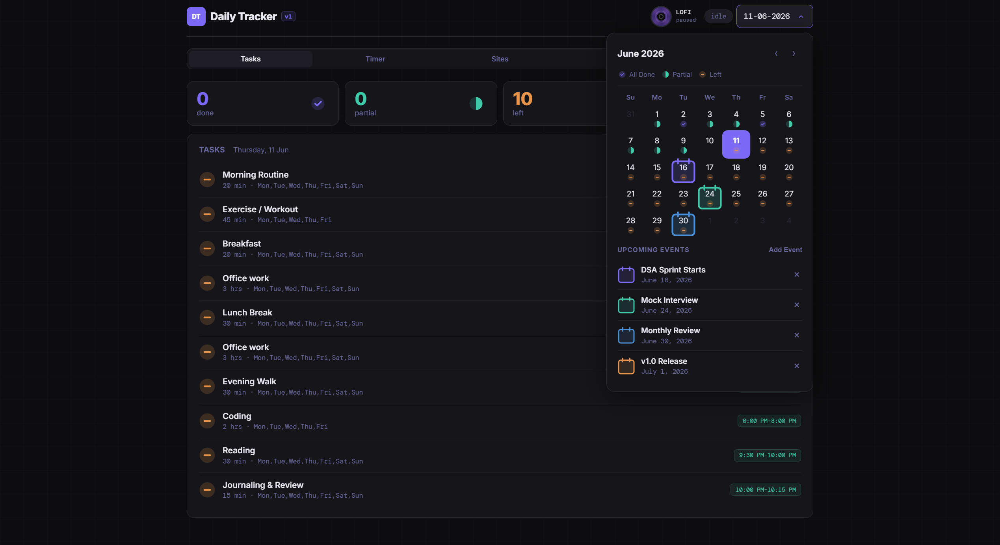
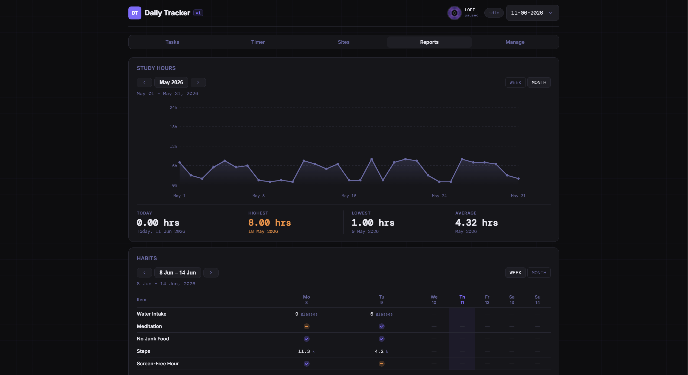
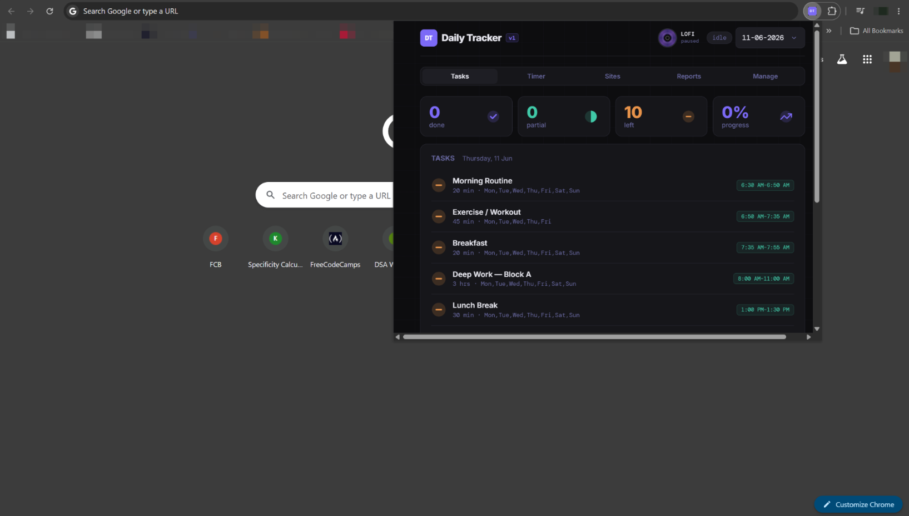

# Daily Tracker

A local-first productivity app that works as a **web app** and a **browser extension**.

<p align="center"></p>
<p align="center"></p>

## Project structure

```
daily-tracker/
├── index.html                  # Web app
├── extension-version.html      # Browser extension
├── manifest.json
├── vercel.json                 # Vercel
├── assets/
│   ├── css/
│   │   └── styles.css
│   └── js/
│       ├── init.js             # entry point
│       ├── state.js
│       ├── storage.js
│       ├── ui.js
│       ├── helpers.js
│       ├── tasks.js
│       ├── timer.js
│       ├── sites.js
│       ├── log.js
│       ├── reports.js
│       ├── calendar.js
│       ├── manage.js
│       ├── gdrive.js
│       ├── lofi.js
│       └── events.js
├── icons/
│   ├── icon16.png
│   ├── icon32.png
│   ├── icon48.png
│   └── icon128.png
```

## Run as web app

```bash
# Open directly
open index.html

# Or with a local server
npx serve .
python3 -m http.server 3000
```

## Browser extension installation

<p align="center"></p>

### Chrome / Edge / Brave
1. Go to `chrome://extensions`
2. Enable **Developer mode** (top-right toggle)
3. Click **Load unpacked** then select the `daily-tracker` folder
4. Done

### Firefox
1. Go to `about:debugging#/runtime/this-firefox`
2. Click **Load Temporary Add-on…** then select `manifest.json`

## Features

- **Tasks** — Daily checklist
- **Timer** — Focus session timer
- **Sites** — Quick-launch bookmarks sites with time tracking
- **Habits** — Habit trackers with weekly/monthly history
- **Reports** — Study-hours Graphs
- **Calendar** — Calendar events navigation
- **Lofi Player** — Built-in lo-fi song player
- **Google Drive Sync** — Backup and restore via a short-lived OAuth token

All data lives in `localStorage`. Nothing leaves your browser unless you use Drive sync.

## Google Drive Sync

1. Open [OAuth 2.0 Playground](https://developers.google.com/oauthplayground)
2. In the scope field paste: `https://www.googleapis.com/auth/drive.file`
3. Click **Authorize APIs** and sign in with Google
4. Click **Exchange authorization code for tokens**
5. Copy the **Access token** and paste it in **Manage → Google Drive → Connect**

Tokens expire after ~1 hour. Re-paste a fresh token to reconnect.
